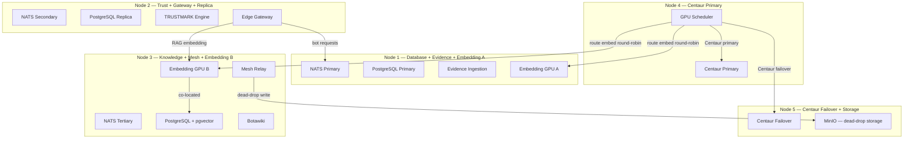

# NC System Architecture

> **Node layout updated per D35 — see [docs/decisions/D35_node_redistribution.md](docs/decisions/D35_node_redistribution.md)**

---

## Cluster Architecture

Five-node cluster. All nodes: AMD Ryzen 9 8945HS, 128GB RAM, Radeon 8060S GPU (40 CU), 2TB NVMe.



### Node Assignment Table

| Node | Role | Services | GPU Use |
|------|------|---------|---------|
| **Node 1** | Database primary, Evidence, Embedding A | NATS Primary, PostgreSQL Primary, Evidence Ingestion, **Embedding GPU A** | Embedding only |
| **Node 2** | Trust engine, Gateway, DB replica | NATS Secondary, PostgreSQL Replica, TRUSTMARK Engine, **Edge Gateway** | None (CPU-only services) |
| **Node 3** | Knowledge, Mesh, Embedding B | NATS Tertiary, PostgreSQL + pgvector, Botawiki, Mesh Relay, **Embedding GPU B** | Embedding only (co-located with pgvector) |
| **Node 4** | Centaur primary | **Centaur Primary**, GPU Scheduler | Centaur exclusively |
| **Node 5** | Centaur failover, Object storage | **Centaur Failover**, MinIO | Centaur exclusively |

### Embedding Pool

GPU Scheduler (Node 4) manages two dedicated embedding GPUs as a single logical pool:

| GPU | Node | Routing Rule |
|-----|------|-------------|
| GPU A | Node 1 | Direct embedding calls — round-robin |
| GPU B | Node 3 | RAG embedding (always) + direct calls — round-robin |

RAG queries always embed on GPU B (Node 3) to eliminate the cross-node hop to pgvector. See D35 for routing implementation requirements.

### Dead-Drop Storage

Dead-drop mesh messages are stored in **MinIO on Node 5** (not NATS JetStream).

- Bucket: `nc-dead-drops`
- TTL: 72 hours via MinIO lifecycle rule (see D25)
- Lifecycle policy: `infra/minio/dead_drop_lifecycle.md`

---

## Service Communication

All inter-node communication goes through NATS JetStream. The NATS cluster uses a 3-node quorum (Nodes 1, 2, 3) for stream leader election.

```
Bot / Warden
    │
    ▼
Edge Gateway (Node 2)           ← NC-Ed25519 auth, rate limiting (D24)
    │
    ├── EVIDENCE stream          → Evidence Ingestion (Node 1)
    ├── TRUSTMARK stream         → TRUSTMARK Engine (Node 2, local)
    ├── BOTAWIKI stream          → Botawiki (Node 3)
    ├── SCHEDULER stream         → GPU Scheduler (Node 4)
    │       ├── Centaur          → Centaur Primary (Node 4) / Failover (Node 5)
    │       └── Embedding        → GPU A (Node 1) or GPU B (Node 3)
    ├── MESH stream              → Mesh Relay (Node 3)
    │       └── dead-drop write  → MinIO (Node 5)
    └── BROADCAST stream         → All nodes (Foundation messages)
```

---

## Phase Rollout

| Phase | Services Live | Nodes Active |
|-------|-------------|-------------|
| 0 | aegis-crypto, aegis-schemas | — (library only) |
| 1 | Adapter (aegis-adapter, aegis-proxy, etc.) | Local warden machines |
| 2 | NATS, PostgreSQL, TRUSTMARK, Botawiki, Gateway | Nodes 1–3 |
| 3 | Centaur, Embedding Pool, Mesh, Dead-drops, Scheduler | All 5 nodes |
| 4 | Anti-gaming, benchmark verification | All 5 nodes |

Phase 3 requires the D35 node layout before any service deployment configuration is written.

---

## Capacity (Phase 3, D35 layout)

| Metric | Value |
|--------|-------|
| Centaur throughput | ~1,944 queries/hr (both nodes) |
| Safe T3 bot ceiling | ~108 active bots at 30/hr, 60% utilisation |
| RAG latency | ~16ms (embedding on GPU B, co-located with pgvector) |
| Embedding saturation | None — two dedicated GPUs, no Centaur competition |
| Dead-drop storage | ~10TB NVMe via MinIO (NATS 1GB limit no longer applies) |

---

*For the full analysis and decision rationale, see [docs/decisions/D35_node_redistribution.md](docs/decisions/D35_node_redistribution.md).*
