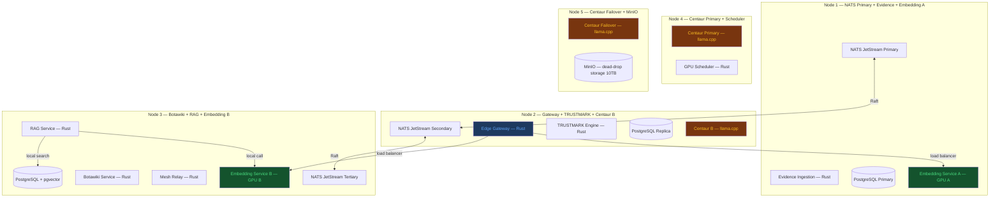

# Neural Commons — System Architecture

## Cluster Node Layout (D35)

## Tech Stack Summary

| Component | Technology | Notes |
|-----------|-----------|-------|
| Adapter transport | HTTPS + WSS to Edge Gateway | D3 v2 — no NATS dependency on client. Standard reqwest + tokio-tungstenite. NATS internal only. |
| Internal messaging | NATS JetStream (all 5 nodes) | Async fan-out, persistence, subject ACLs. Used for evidence, TRUSTMARK, Botawiki pipeline, mesh, Centaur scheduling, broadcast. NOT used for synchronous embedding paths (load balancer instead). |
