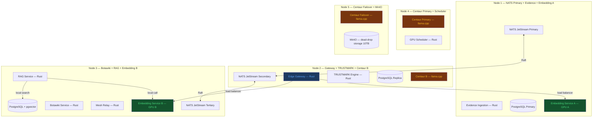

# Neural Commons — System Architecture

## Cluster Node Layout (D35)

## NATS Topic Topology (D3 v3)

| Stream | Subjects | Publishers | Subscribers | Retention | Note |
|---|---|---|---|---|---|
| EVIDENCE | evidence.new, evidence.rollup | Evidence Ingestion | TRUSTMARK Engine, archiver | File, 30 days | |
| TRUSTMARK | trustmark.updated | TRUSTMARK Engine | Gateway cache, tier-gate | File, 7 days | |
| BOTAWIKI | botawiki.claim.new, botawiki.quarantine.vote, botawiki.dispute.new, botawiki.embed | Botawiki Service | quarantine-validator, dispute-handler, embed-indexer | File, 90 days | botawiki.embed is the async background indexing subject — Embedding Service Node 3 consumes it |
| MESH | mesh.relay, mesh.key.update | Mesh Relay | mesh-router, key-directory | Memory, 72h | Dead-drops go to MinIO (Node 5), not this stream |
| SCHEDULER | scheduler.request, scheduler.assigned, scheduler.heartbeat, scheduler.completed | GPU Scheduler | Centaur nodes (2, 4, 5) | Memory, WorkQueue | Option B: Centaur only. Direct embedding uses Gateway load balancer — NOT this stream. Option C: embedding added here when Nodes 1+3 also run Centaur. |
| BROADCAST | broadcast.emergency, broadcast.policy | Policy Distribution | All connected adapters via Gateway WSS | File, 365 days | |

### Embedding Routing — Three Scenarios (D3 v3 + D35)

| Scenario | Transport | NATS? | Latency | Rate limit ticks? |
|---|---|---|---|---|
| RAG — embed the question | Local call, Node 3 in-process | No | ~2ms | No (internal) |
| POST /embedding from bot | Gateway load balancer → Node 1 or 3 | No | ~15ms | Yes — embedding counter +1 |
| Botawiki write — index claim | NATS async botawiki.embed → Node 3 | Yes | seconds (background) | No (internal) |

Principle: NATS is used only where work is genuinely async. The
load balancer at the Gateway handles direct embedding — round-robin
or least-connections across Nodes 1 and 3.

Option C: when Centaur is added to Nodes 1+3 (escalation config),
the GPU Scheduler is also used for embedding routing. Config change,
not code change.

## Tech Stack Summary

| Component | Technology | Notes |
|-----------|-----------|-------|
| Adapter transport | HTTPS + WSS to Edge Gateway | D3 v2 — no NATS dependency on client. Standard reqwest + tokio-tungstenite. NATS internal only. |
| Internal messaging | NATS JetStream (all 5 nodes) | Async fan-out, persistence, subject ACLs. Used for evidence, TRUSTMARK, Botawiki pipeline, mesh, Centaur scheduling, broadcast. NOT used for synchronous embedding paths (load balancer instead). |
